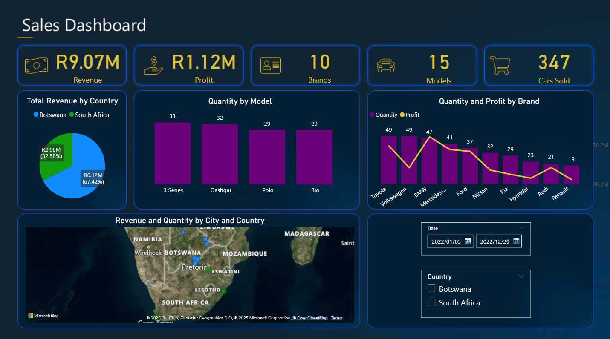

# 🚗 Car Sales Dashboard – Power BI Project

## 📄 Dataset Description

This project analyses car sales data across two countries: South Africa and Botswana. The dataset contains information on car models, brands, revenue, profit, quantity sold, and dealership locations.

## 🔍 Business Questions Answered

1. **Total Revenue generated by sales in each country**
2. **The Top 3 Car Models Sold**
3. **A Comparison of Profit vs. Sales Quantity amongst Brands**

## 📊 Insights

### 1. Revenue by Country
- **South Africa** contributed the majority of the revenue: **R6.12M (67.42%)**.
- **Botswana** contributed **R2.96M (32.58%)**.
- The reason as to why would require additional data relating to each countries economic performance all the way to consumer spending habits within the respective countries.

### 2. Top 3 Car Models Sold
- **BMW 3 Series** (33 units)
- **Nissan Qashqai** (32 units)
- **Volkswagen Polo & Kia Rio** (tied at 29 units)

### 3. Profit vs Sales Quantity by Brand
- While Toyota, Volkswagen, and BMW sold the highest number of units (49 each)
- Mercedes-Benz had the highest profit per unit, showing a high-margin product strategy.
- Audi and Renault had lower sales and profit numbers.

A special thanks to Prof. Tarcisio de Oliveira Filho (MCT) for providing the dataset and business cases/questions.
